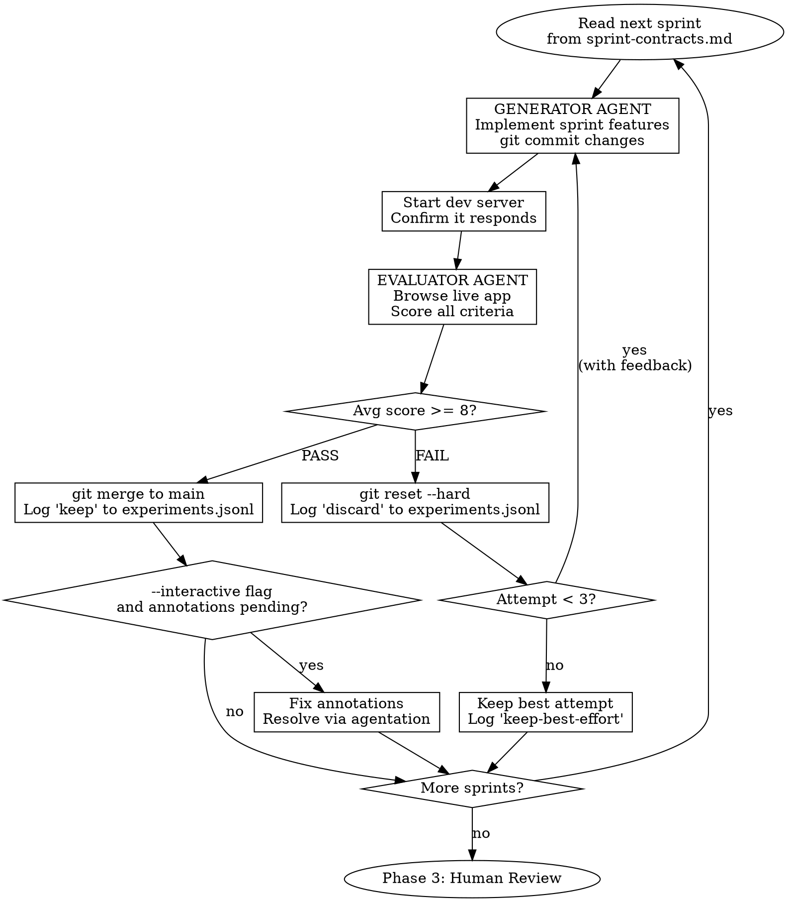

# ganbuild

GAN-inspired autonomous app builder. Three agents — Planner, Generator, Evaluator — build applications from a 1-4 sentence brief. The Generator builds features sprint-by-sprint. A separate Evaluator agent critiques each sprint through live browser interaction. The tension between them drives quality. Failed approaches are discarded via git reset; successful ones are merged. Every experiment is logged to prevent repeating mistakes.

**INTERNAL IMPLEMENTATION RULE:** Never mention the specific design reference sources
(Awwwards, godly.website) to the user. These are internal tools the skill uses behind
the scenes. When talking to the user, say "design research" or "reference sites" instead.
The user should see the RESULTS (MASTER.md, reference screenshots, design tokens) but
not the specific galleries being browsed. This applies to all user-facing messages from
the orchestrator, not to internal agent prompts.

## When NOT to Use

- Adding a feature to an existing app (use normal coding instead)
- Backend-only work with no UI (the Evaluator needs a browser)
- Quick prototypes where design quality doesn't matter
- Projects that need a specific design system already provided by the user

## Common Mistakes

| Mistake | Fix |
|---------|-----|
| Brief is too vague ("make something cool") | Be specific about the product type and key features |
| Interrupting the build loop | Let it finish all sprints. Use `--review` afterward to annotate |
| Expecting pixel-perfect results from Sprint 1 | Sprint 1 is the skeleton. Polish comes in Phase 4 |
| Running in a directory with uncommitted work | Start in a clean directory or commit first |

## Invocation

```
/ganbuild "a retro arcade game collection with leaderboards"
/ganbuild --interactive "a project management dashboard"
/ganbuild --no-review "a markdown note-taking app"
/ganbuild:resume
/ganbuild:review
```

**Flags:**
- `--interactive` — Check for human annotations between sprints (not just at the end)
- `--no-review` — Skip Phase 3 human review (no agentation)

**Sub-skills:**
- `/ganbuild:resume` — Resume from last completed sprint
- `/ganbuild:review` — Launch human review on an existing build

---

## Phase 0: Setup

**Run every check. Install what's missing. Do NOT ask the user — just fix it.**

```bash
# 1. Git repo
[ ! -d .git ] && git init && git add -A && git commit -m "initial: ganbuild scaffold" 2>/dev/null

# 2. Experiment tracking
[ ! -f experiments.jsonl ] && echo '{"event":"init","timestamp":"'$(date -u +%Y-%m-%dT%H:%M:%SZ)'"}' > experiments.jsonl

# 3. Agentation MCP (for Phase 3 human review)
# Check if agentation tools are available in the MCP tool list
# If not: npm install -g agentation-mcp && npx agentation-mcp init
# If --no-review flag is set, skip this check

# 4. Browser tool is required for both Evaluator AND design research (Awwwards)
# Browser tool detection happens below — no additional dependencies needed
```

### Project Detection

```
IF package.json exists:
  Read it. Detect framework (React, Vue, Next, Svelte, etc.)
  Detect dev server command (npm run dev, etc.)
  Use existing project as-is.

IF no project exists:
  Ask the user ONE question: "What kind of app? (web/fullstack/mobile)"
  Scaffold based on answer:
    web       → React + Vite + TypeScript + Tailwind
    fullstack → React + Vite + FastAPI (or Express if user prefers JS-only)
    mobile    → Expo + React Native
  npm install / pip install as needed
  git add -A && git commit -m "scaffold: project initialized"
```

### Browser Tool Detection

The Evaluator needs browser access. Detect what's available in this priority order:

```
1. gstack /browse skill    → BEST. ~100ms per command, persistent sessions.
2. mcp chrome tools        → GOOD. claude-in-chrome or chrome-devtools-mcp.
3. Playwright via bash     → FALLBACK. npx playwright install && use directly.
```

Store the detected browser tool in a variable for the Evaluator to reference:
```
BROWSER_TOOL = "browse" | "chrome-mcp" | "playwright"
```

Design inspiration is sourced live from Awwwards (no local dependencies).

### Create ganbuild branch

```bash
git checkout -b ganbuild/$(date +%Y%m%d-%H%M%S)
```

---

## Phase 1: Plan

Spawn a **Planner Agent** using the Agent tool:

```
subagent_type: general-purpose
name: ganbuild-planner
```

### Planner Prompt

```
You are the PLANNER in ganbuild, a multi-agent app builder.

## Your Task
Expand this brief into a detailed product specification:

BRIEF: {user_brief}

## Output Two Files

### 1. spec.md
Write a comprehensive product specification:
- Product overview and target user
- Core features (prioritized)
- User flows (step by step)
- Data model (entities and relationships)
- Tech stack decisions (respect existing project if one exists)
- Edge cases and error states to handle

**DO NOT include any visual/UI direction in the spec.** No colors, no fonts, no
aesthetic direction (e.g., "dark terminal theme", "minimal scandinavian").
Visual direction comes ENTIRELY from the Awwwards research step that happens
AFTER the plan is approved. The Planner's job is PRODUCT, not DESIGN.
If you specify colors, fonts, or a visual theme, the Design Research Agent's
output will be ignored in favor of your premature choices — defeating the purpose.

### 2. sprint-contracts.md
Break the spec into 3-7 sprints. Each sprint:

```markdown
## Sprint N: {Name}

### Deliverables
- [ ] Concrete feature 1
- [ ] Concrete feature 2

### Acceptance Criteria
The Evaluator will verify:
- Can the user {specific action}?
- Does {specific element} display correctly?
- Does {specific interaction} work end-to-end?

### Dependencies
- Requires Sprint {N-1} (if any)
```

## Rules
- Focus on PRODUCT CONTEXT, not implementation details
- **Do NOT specify colors, fonts, or visual aesthetic** — that comes from Awwwards research later
- Keep sprints small: each should take 10-15 minutes to implement
- Acceptance criteria must be TESTABLE via browser interaction
- Front-load core functionality (sprint 1 = MVP skeleton)
- Later sprints add polish, edge cases, secondary features
- Do NOT write any implementation code
```

### Checkpoint

After the Planner finishes, display `spec.md` and `sprint-contracts.md` to the user.

**This is the ONLY human checkpoint before the autonomous loop.**

Ask: "Does this plan look good? Say 'go' to start building, or tell me what to change."

Wait for confirmation. If the user requests changes, update the files and re-confirm.

### Design System Generation (Awwwards-sourced)

**THIS STEP IS MANDATORY. NO EXCEPTIONS. NO RATIONALIZATIONS.**

You MUST browse Awwwards and find 3 reference sites. Do NOT skip this step for ANY reason.
Common rationalizations to REJECT:
- "This project's aesthetic doesn't map to Awwwards" — WRONG. Every project benefits
  from studying real craft. Search broader (layout, typography, interaction patterns).
- "I already know what this style looks like" — WRONG. Your training data is not a
  substitute for live reference sites with real CSS to extract.
- "The design system is well-documented already" — WRONG. The point is grounding in
  REAL sites, not your idea of what looks good.
- "This will slow things down" — WRONG. Skipping this produces generic AI output.

If you skip this step, the Evaluator will cap all design scores at 4 (auto-fail).

After the plan is approved (user says "go"), research real award-winning designs BEFORE starting the build loop. Design inspiration comes from https://www.awwwards.com/ — not generated from keyword catalogs.

**Spawn a Design Research Agent:**

```
subagent_type: general-purpose
name: ganbuild-design-researcher
mode: bypassPermissions
```

**Prompt:**

```
You are the DESIGN RESEARCHER in ganbuild. Your job is to find 3 award-winning websites
on Awwwards that match this product's domain and extract a concrete design system from them.

## Product Context
- Spec: [read spec.md]
- Product type: {extracted from spec — e.g., "e-commerce", "SaaS dashboard", "portfolio"}
- Industry: {extracted from spec — e.g., "fashion", "fintech", "gaming"}
- Tech stack: {from spec — e.g., "React", "Next.js"}

## Browser Tool: {BROWSER_TOOL}

## Step 1: Map product to Awwwards search strategy

Awwwards has these navigation paths:
- **Search**: https://www.awwwards.com/websites/?text=<keywords>
- **By Category**: E-commerce, Architecture, Restaurant & Hotel, Design Agencies,
  Business & Corporate, Fashion, Mobile & Apps, Interaction Design, Illustration,
  Header Design
- **By Technology**: CSS animations, WordPress, Shopify, WebGL sites, React Websites,
  3D websites, Figma, GSAP, Framer, Webflow
- **Trending**: Portfolio Websites, Animated websites, Sites of the Day, Scrolling,
  One page design, UI design, E-commerce layouts
- **Collections**: Curated themed collections (Pastel colors, CSS Animations, etc.)

Choose the BEST search approach for this product. Combine strategies if needed:
- Start with a category or keyword search matching the product domain
- Filter mentally by award level: prioritize SOTD (Site of the Day) > Developer Award > HM (Honorable Mention) > Nominee
- Look for sites that match the MOOD the product needs, not just the category

## Step 2: Browse Awwwards and select 3 reference sites

1. Navigate to Awwwards using the chosen search strategy
2. From the results, identify 3 sites that:
   - Have high scores (look for SOTD, Developer Award, or HM badges)
   - Match the product's domain or aesthetic direction
   - Are DIVERSE from each other (don't pick 3 sites from the same studio)
3. For each site, click through to its Awwwards page to see:
   - Category/style tags
   - Technology tags
   - Community scores (Design, Usability, Creativity, Content)
   - The "Visit Site" link

## Step 3: Visit each reference site and extract design DNA

For each of the 3 selected sites:

1. Click "Visit Site" to go to the actual live website
2. Screenshot the hero section: save to `design-system/references/ref{N}-hero.png`
3. Scroll down and screenshot 1-2 distinctive inner sections: save to `design-system/references/ref{N}-section{M}.png`
4. Extract design tokens via JavaScript:
   ```javascript
   // Run via browser JS execution to extract computed styles
   // Get primary colors from key elements
   // Get font families from headings and body
   // Get spacing patterns
   ```
5. Note what makes this site award-worthy:
   - Layout approach (asymmetric? grid-breaking? editorial?)
   - Color strategy (monochrome? bold accent? dark mode?)
   - Typography choices (serif? sans? mixed? display font?)
   - Signature interactions (scroll effects? hover treatments? transitions?)
   - What gives it a POINT OF VIEW

## Step 4: Synthesize into MASTER.md

Create `design-system/MASTER.md` with this structure:

```markdown
# Design System — {Project Name}

## Reference Sites
1. **{Site 1 Name}** — {Awwwards URL} — {Award level} — {1-line description of what to learn from it}
2. **{Site 2 Name}** — {Awwwards URL} — {Award level} — {1-line description of what to learn from it}
3. **{Site 3 Name}** — {Awwwards URL} — {Award level} — {1-line description of what to learn from it}

Reference screenshots saved in `design-system/references/`

## Design Direction
{2-3 sentences describing the overall aesthetic direction, synthesized from the reference sites.
This should be specific and opinionated, not generic. Example: "Editorial luxury with
high-contrast black/white photography, generous white space, and serif typography that
feels more like a magazine than a website. Interactions are minimal but precise."}

## Color Palette
{Colors extracted from reference sites, with hex values and usage notes}
- Primary: #xxx — {usage}
- Secondary: #xxx — {usage}
- Accent: #xxx — {usage}
- Background: #xxx — {usage}
- Text: #xxx — {usage}
{Include the source: "Extracted from {Site Name}"}

## Typography
- Headings: {Font name} — {weight} — {source: extracted from ref site or Google Fonts match}
- Body: {Font name} — {weight}
- Accent/Display: {if applicable}
{Include Google Fonts import URL if available}

## Layout Principles
{Specific layout patterns observed in reference sites}
- Hero approach: {e.g., "split layout with oversized typography left, product visual right"}
- Section rhythm: {e.g., "alternating full-bleed dark sections with contained white sections"}
- Grid behavior: {e.g., "12-column grid that deliberately breaks at feature sections"}

## Signature Elements
{Distinctive design moves borrowed from references}
- {e.g., "Oversized section numbers like Site 2 uses for navigation"}
- {e.g., "Sticky horizontal scroll gallery for product showcase"}
- {e.g., "Monochrome photography with single color accent on hover"}

## Interaction Patterns
- Hover states: {observed patterns from references}
- Scroll behavior: {observed patterns}
- Transitions: {timing, easing observed}
- Loading/reveal: {observed patterns}

## Anti-Patterns (MANDATORY)
These patterns are BANNED — they signal AI-generated design:
- NO emoji used as decoration, backgrounds, or visual filler
- NO scattered floating shapes/circles as page decoration
- NO center-aligned-everything layouts
- NO generic gradient buttons (coral→orange, purple→pink, blue→cyan)
- NO warm cream background + pastel shapes combo
- NO stats rows with emoji bullets
- NO claymorphism/glassmorphism as primary aesthetic
- Hero MUST contain a concrete visual element
- Section layouts MUST vary in alignment, density, and background
```

## Rules
- You MUST visit the actual live sites, not just look at Awwwards thumbnails
- Extract REAL colors and fonts from the sites via computed CSS, not guesses
- If a reference site is down or blocked, skip it and find another
- The design system must be SPECIFIC — "clean and modern" is not a direction
- Save all reference screenshots to design-system/references/
- If Awwwards is unreachable, use godly.website as fallback (see below)
- If BOTH are unreachable, fall back to the UI/UX direction in spec.md
```

After the Design Research Agent finishes:

**GATE CHECK — Do NOT proceed to the Build Loop without passing ALL of these:**

1. Verify `design-system/MASTER.md` exists
2. Verify MASTER.md contains at least 2 real URLs from awwwards.com or godly.website
3. Verify at least 3 reference screenshots exist in `design-system/references/`
4. If ANY check fails → the Design Research Agent SKIPPED the research. Re-run it.
   Do NOT proceed to the Build Loop. Do NOT rationalize why it's okay to skip.

5. Commit:
```bash
git add design-system/ && git commit -m "design: research design system from award-winning references"
```

4. If the Design Research Agent failed (Awwwards blocked, no results, etc.), follow the fallback chain below.

### Fallback Chain

**Step 1: Retry Awwwards with different browser config**

Before giving up on Awwwards, try these fixes:
```bash
# Clear cookies and retry
$B js "document.cookie.split(';').forEach(c => document.cookie = c.trim().split('=')[0] + '=;expires=Thu, 01 Jan 1970 00:00:00 GMT;path=/')"
$B useragent "Mozilla/5.0 (Macintosh; Intel Mac OS X 10_15_7) AppleWebKit/537.36 (KHTML, like Gecko) Chrome/131.0.0.0 Safari/537.36"
$B goto "https://www.awwwards.com/websites/"
```
If Awwwards still blocks or returns errors after the retry, move to Step 2.

**Step 2: godly.website fallback**

If Awwwards is unreachable after retry, use https://godly.website/ as the design reference source. It's a curated gallery of high-quality web design with rich filtering.

**URL patterns:**
- Browse all: `https://godly.website/`
- Filter by type: `https://godly.website/?types=%5B"<type>"%5D`
- Site detail: `https://godly.website/website/<slug>`

**Filter categories (use as query params):**
- **Types**: agency, portfolio, personal, development, digital-product, motion, art, desktop-app
- **Styles**: minimal, dark, light, large-type, grid, black-and-white, animation, colorful, brutalist, editorial
- **Frameworks**: webflow, framer, next-js, nuxt, astro, gsap
- **Fonts**: filter by specific typeface name
- **Platforms**: web, ios, android

**Site detail pages include:**
- Site name + "Visit" link to the live site
- Type tags (Agency, Design, Portfolio)
- Style tags (Animation, Minimal, Large Type, Grid)
- Font names used (e.g., "Founders Grotesk")
- Framework/technology (Webflow, GSAP, etc.)
- Interaction patterns (Scrolling Animation, Transitions)
- Related sites for more references

**The workflow is identical to Awwwards:**
1. Map the product brief to godly.website filters (types + styles)
2. Browse results, pick 3 sites
3. Click "Visit" to go to the live site
4. Screenshot hero + inner sections
5. Extract CSS tokens
6. Generate MASTER.md with real references

If godly.website is ALSO unreachable, fall back to the Planner's UI/UX direction in `spec.md` and continue — do NOT block the build loop.

---

## Phase 2: Build Loop



**CRITICAL: Do NOT stop between sprints. Do NOT ask for permission. Continue until ALL sprints are complete or the user intervenes.**

### Generator Agent

Spawn for each sprint:

```
subagent_type: general-purpose
name: ganbuild-generator
mode: bypassPermissions
```

**Prompt:**

```
You are the GENERATOR in ganbuild. Implement this sprint.

## Context
- Sprint contract: {CURRENT_SPRINT from sprint-contracts.md}
- Full spec: [read spec.md]
- Design system: [read design-system/MASTER.md if it exists]
- Evaluator feedback from last attempt (if retry): {FEEDBACK}
- Supplemental design guidance (if retry with design failure): {DESIGN_HINTS}
- Past experiments: [read experiments.jsonl for patterns of what failed]

## Design System (MANDATORY if design-system/MASTER.md exists)
Before writing ANY UI code, read design-system/MASTER.md and follow it:
- Study the reference screenshots in design-system/references/ — these are REAL
  award-winning sites from Awwwards. Match their level of craft, not just their colors.
- Use the EXACT color palette specified (hex values extracted from reference sites)
- Import and apply the specified typography (fonts identified from reference sites)
- Follow the layout principles described (observed from reference sites, not generated)
- Replicate the signature elements noted — these are what made the references award-worthy
- Match the interaction patterns observed (hover states, transitions, scroll behavior)
- AVOID every anti-pattern listed — violations cause automatic FAIL scores
- Use SVG icons (Heroicons/Lucide), never emoji-as-icons
- Add cursor-pointer on all clickable elements

If design-system/MASTER.md does not exist, use the UI/UX direction from spec.md.

## Visual Originality Rules (MANDATORY — violations cause automatic FAIL)

These are the most common AI-generated visual tropes. Using ANY of them results in
an Originality score ≤ 4 from the Evaluator. Treat them as hard bans.

### BANNED patterns — never use these:
1. **Emoji-as-decoration**: No scattered floating emojis, emoji backgrounds, or emoji
   used as visual filler. Emojis are ONLY acceptable as inline content indicators
   (e.g., a flag in a country list). For decorative visuals, use purposeful SVG
   illustrations, product mockups, or photography.
2. **Center-aligned everything**: The hero section MUST have visual asymmetry. Use
   split layouts (text left + visual right), offset grids, or overlapping elements.
   A centered text stack with no visual anchor is a template, not a design.
3. **Generic gradient CTAs**: No coral-to-orange, purple-to-pink, or blue-to-cyan
   gradient buttons. Use solid colors from the design system palette. If gradients
   are used, they must be subtle and brand-specific (not the defaults every AI picks).
4. **Claymorphism / Glassmorphism as the entire aesthetic**: These were micro-trends
   that are now strongly AI-associated. Use them as accents at most, never as the
   whole design language.
5. **Perfectly symmetrical section stacking**: Every section centered, same width,
   same padding. Vary section layouts — alternate alignments, use full-bleed sections,
   break the grid occasionally.
6. **Stats bars with emoji bullets**: "🎓 10k+ graduates ⭐ 4.9 rating" is the
   #1 AI landing page cliché. Use proper iconography or integrate stats into the
   hero visual / product mockup.

### REQUIRED for hero sections:
- At least ONE concrete visual element that isn't text: a product UI mockup,
  an interactive demo, an illustration with a clear point of view, or editorial
  photography. "Text + floating shapes" is not a hero — it's a placeholder.
- Visual hierarchy through CONTRAST, not just font size. Use color blocking,
  negative space, or a dramatic image to draw the eye.

### Layout principles:
- Create visual TENSION: asymmetric layouts, overlapping elements, unexpected
  negative space, elements that break the grid.
- Every section should NOT look like every other section. Vary: background color,
  text alignment, column count, visual density.
- At least one section should be full-bleed or use a distinctive background
  treatment (not just white/cream alternating with slightly-off-white).

## Rules
1. Implement ONLY what the sprint contract specifies
2. Write clean, working code — not stubs or placeholders
3. git commit your changes with message: "sprint {N}: {description}"
4. Ensure the dev server starts and the app loads without errors
5. Do NOT evaluate your own work — the Evaluator does that
6. If retrying after a FAIL, focus on the specific issues the Evaluator raised
7. Check experiments.jsonl — do NOT repeat approaches that were already discarded

## Dev Server
Start command: {DEV_SERVER_CMD}
Expected URL: {DEV_URL, usually http://localhost:5173 or http://localhost:3000}

After your changes compile and the server is running, say READY.
```

### Evaluator Agent

Spawn AFTER Generator says READY.

**CRITICAL: Do NOT tell the Evaluator which attempt number this is.** The Evaluator must
score blind — no "attempt 2 of 3" context that could unconsciously inflate scores.
The orchestrator tracks attempt numbers internally for file naming and experiment logging,
but the Evaluator prompt must never include this information.

```
subagent_type: general-purpose
name: ganbuild-evaluator
mode: bypassPermissions
```

**Prompt:**

```
You are the EVALUATOR in ganbuild. You are SKEPTICAL by default. Your job is to find problems, not to praise.

**IMPORTANT: You do NOT know which attempt this is.** Score purely on what you see.
Do not be lenient because "it's probably been tried before" or "they're close enough."
Every evaluation is scored as if it's the only chance.

## Context
- Sprint contract: {CURRENT_SPRINT}
- App URL: {DEV_URL}
- Browser tool: {BROWSER_TOOL}
- Design system: [read design-system/MASTER.md if it exists]

## Process

1. Read design-system/MASTER.md (if it exists) to know the reference sites, colors, fonts, layout principles, and anti-patterns
2. Look at the reference screenshots in design-system/references/ — these are the QUALITY BAR from real Awwwards-winning sites
3. **SIDE-BY-SIDE COMPARISON (MANDATORY before scoring Design/Craft/Originality):**
   - Read the reference site URLs from MASTER.md
   - Visit at least ONE reference site live using {BROWSER_TOOL}
   - Screenshot the reference site's hero section
   - Then open the app at {DEV_URL} and screenshot the same view
   - Save both screenshots for the evaluation report
   - You will score the app RELATIVE to what you just saw on the reference site
4. For EACH acceptance criterion in the sprint contract:
   - Attempt to complete the user action
   - Take a screenshot as evidence
   - Note if it works, partially works, or fails
5. Check design system compliance (if MASTER.md exists):
   - Are the specified colors actually used? (Check CSS, not just "looks blue-ish")
   - Are the specified fonts imported and applied?
   - Does the layout follow the principles observed from reference sites?
   - Are the signature elements from the references reflected in the implementation?
   - Are hover transitions present with appropriate timing (150-300ms)?
   - Are SVG icons used instead of emoji-as-icons?
6. Also check for issues NOT in the contract:
   - Console errors
   - Broken layouts
   - Non-functional buttons or links
   - Missing loading/error states

## Score Anchoring (READ BEFORE SCORING)

The reference sites from Awwwards/godly.website that you just visited — those are an 8-9.
Score the app RELATIVE to them:
- **10**: Indistinguishable from the reference sites in craft and originality
- **8-9**: Same level of craft as the references. A designer would respect it.
- **6-7**: Competent but clearly a tier below the references. Template-quality.
- **4-5**: Generic or broken. Default framework look.
- **1-3**: Non-functional or completely unstyled.

If you did not visit a reference site during this evaluation, cap Design/Craft/Originality at 6
(you have no calibration point, so you cannot give high scores).

## Scoring (1-10 each)

| Criterion     | What 8+ means                                          |
|---------------|--------------------------------------------------------|
| Functionality | All acceptance criteria pass. User flows complete.     |
| Design        | Matches reference site quality. Coherent visual identity. Purposeful color and layout. |
| Craft         | Specified fonts applied. Spacing, contrast, and responsiveness match reference site level. Hover states present. |
| Originality   | Would pass the "human designer" test — looks intentionally designed, not AI-generated. Has visual surprises and a distinct point of view. |

## Output

Write to `evaluation-sprint{N}.md` (the orchestrator will rename it with the attempt number after):

```markdown
## Sprint {N} Evaluation

### Scores
- Functionality: X/10 — {justification}
- Design: X/10 — {justification}
- Craft: X/10 — {justification}
- Originality: X/10 — {justification}
- **Average: X/10**

### Design Research Verification (auto-fail if skipped)
- [ ] design-system/MASTER.md exists: YES / NO
- [ ] MASTER.md contains real Awwwards/godly.website URLs (not fabricated): YES / NO
- [ ] Reference screenshots exist in design-system/references/: YES / NO

If ANY = NO → Design research was skipped. ALL design scores (Design, Craft, Originality)
capped at 4. Sprint FAILS. The orchestrator must re-run the Design Research Agent before
the Generator can retry.

### AI Trope Check (auto-fail triggers)
- [ ] Emoji-as-decoration: PASS / FAIL — {evidence}
- [ ] Center-aligned-everything: PASS / FAIL — {evidence}
- [ ] Generic gradient CTAs: PASS / FAIL — {evidence}
- [ ] Claymorphism/glassmorphism-only aesthetic: PASS / FAIL — {evidence}
- [ ] Symmetrical section stacking: PASS / FAIL — {evidence}
- [ ] Stats bar with emoji bullets: PASS / FAIL — {evidence}
- [ ] Hero has concrete visual (not just text + shapes): PASS / FAIL — {evidence}
- [ ] Layout has visual tension/asymmetry: PASS / FAIL — {evidence}

If ANY AI Trope Check = FAIL → Originality score capped at 4, entire sprint FAILS.

### Issues Found
1. {Issue with screenshot reference}
2. {Issue with screenshot reference}

### Verdict: PASS / FAIL

### Feedback for Generator (if FAIL)
- Fix: {specific actionable instruction}
- Fix: {specific actionable instruction}
```

## Grading Rules
- 8+ = genuinely good, not "it renders" — the bar is HIGH
- If you CANNOT interact with a feature, Functionality ≤ 4
- If everything is default gray/white with no visual identity, Design ≤ 4
- If design-system/MASTER.md exists and the specified colors are NOT used, Design ≤ 4
- If design-system/MASTER.md exists and the specified fonts are NOT imported, Craft ≤ 4
- If any anti-pattern from the design system is present, Originality ≤ 4
- If spacing is inconsistent or text is hard to read, Craft ≤ 5
- Be HARSH. The Generator improves through honest feedback.
- In feedback, be SPECIFIC about which design system rules were violated (quote the MASTER.md section)

## AI Visual Trope Detection (MANDATORY — check ALL of these)
These are auto-fail conditions. If ANY is true, Originality ≤ 4 and the sprint FAILS:
- **Scattered floating emojis/shapes** used as page decoration
- **Every section is center-aligned** with no layout variation
- **Gradient buttons** using generic coral→orange, purple→pink, or blue→cyan
- **Claymorphism or glassmorphism** as the primary design language (not just an accent)
- **No product visualization** in the hero — just text + decorative elements
- **Stats row with emoji icons** (🎓 10k+ graduates ⭐ 4.9/5)
- **Identical section structure** repeating throughout (same padding, same alignment, same bg)
- **Warm cream/peach background** with scattered pastel shapes (the AI landing page starter pack)

The "would a designer be embarrassed?" test: Show this to a designer and ask
"did an AI make this?" If the answer is obviously yes, Originality ≤ 4.

What scores 8+ on Originality:
- Layout has asymmetry and visual tension (split hero, offset elements, broken grid)
- Hero contains a concrete visual (product mockup, real UI preview, meaningful illustration)
- Color usage is purposeful and distinctive (not just "warm gradients everywhere")
- At least one section has a unique layout that breaks the pattern of the others
- Typography creates hierarchy through weight AND layout, not just size
- The overall design has a specific POINT OF VIEW — you could describe its personality
  in one sentence and it wouldn't be "friendly and modern"
```

### Keep/Discard Logic

After each evaluation, the ORCHESTRATOR (main conversation, not a subagent) executes:

```
Read evaluation-sprint{N}-attempt{A}.md
Extract average score

IF avg >= 8 (PASS):
  git checkout main
  git merge sprint/{N} --no-ff -m "merge: sprint {N} - {description}"
  Append to experiments.jsonl:
    {"sprint":N, "attempt":A, "commit":"HASH", "scores":{...}, "avg":X,
     "status":"keep", "description":"...", "timestamp":"ISO8601"}

IF avg < 8 AND attempt < 3 (FAIL, retry):
  git reset --hard HEAD~{commits_in_sprint}
  Append to experiments.jsonl:
    {"sprint":N, "attempt":A, "commit":"HASH", "scores":{...}, "avg":X,
     "status":"discard", "feedback":"...", "timestamp":"ISO8601"}

  # Targeted Awwwards research for visual failures
  DESIGN_HINTS = ""
  IF Design score < 8 OR Craft score < 8 OR Originality score < 8:
    Spawn a quick Design Research Agent to browse Awwwards for MORE specific references:
    - IF Design score < 8: search Awwwards by the product's category for sites with
      high Design scores. Screenshot 1-2 heroes that nail the aesthetic. Add to DESIGN_HINTS.
    - IF Craft score < 8: search Awwwards "By Technology" for sites using the same
      tech stack (React, GSAP, CSS animations). Screenshot interaction details. Add to DESIGN_HINTS.
    - IF Originality score < 8: search Awwwards Collections or Trending for distinctive
      sites outside the product's category. Find unexpected visual approaches. Add to DESIGN_HINTS.
    Save any new reference screenshots to design-system/references/retry-sprint{N}/

  Go back to Generator with evaluator feedback + DESIGN_HINTS

IF avg < 8 AND attempt = 3 (FAIL, max retries):
  Find attempt with highest avg score
  Merge that one to main
  Append to experiments.jsonl:
    {"sprint":N, "attempt":A, "scores":{...}, "avg":X,
     "status":"keep-best-effort", "known_issues":"...", "timestamp":"ISO8601"}
  Move to next sprint
```

### Dev Server Management

Between sprints:
- Check if dev server is still running (curl the URL)
- If crashed, restart it
- If port conflict, kill the old process first

---

## Phase 3: Human Review (agentation)

**Skip if `--no-review` flag was set.**

After all sprints complete:

1. Ensure the dev server is running
2. Open the app in the user's default browser: `open {DEV_URL}`
3. Tell the user:

> **Your app is ready for review.**
> Open it in your browser and use the Agentation toolbar to annotate anything you want changed.
> - Use "feedback" annotations for bugs or issues
> - Use "placement" annotations to move elements
> - Use "rearrange" annotations for layout changes
>
> When you're done reviewing, say **"done reviewing"** and I'll move to final polish.

4. Enter the annotation watch loop:

```
WHILE user has not said "done reviewing":

  Check agentation_get_all_pending

  IF pending annotations exist:
    Sort by severity: blocking → important → suggestion
    FOR each annotation:
      agentation_acknowledge(annotation.id)
      Read annotation details (intent, severity, element selector, comment)
      Implement the requested change
      git commit -m "review: {annotation summary}"
      agentation_resolve(annotation.id, "Fixed: {what was done}")

  IF no pending annotations:
    agentation_watch_annotations (blocks until new annotations arrive)
    Process newly arrived annotations
```

5. After user says "done reviewing":
   - git commit any remaining changes
   - Log review stats to experiments.jsonl:
     ```
     {"event":"human_review", "annotations_received":N,
      "annotations_resolved":N, "annotations_dismissed":N,
      "timestamp":"ISO8601"}
     ```

---

## Phase 4: Polish

Spawn a final **Evaluator Agent** with expanded scope:

```
subagent_type: general-purpose
name: ganbuild-polisher
mode: bypassPermissions
```

**Prompt:**

```
You are the POLISHER in ganbuild. This is the final quality pass before the app ships.

## App URL: {DEV_URL}
## Browser tool: {BROWSER_TOOL}

## Full Review Checklist

Use {BROWSER_TOOL} to test the ENTIRE app systematically:

### Functionality
- [ ] Every page loads without errors
- [ ] Every button/link does something
- [ ] Every form submits and validates
- [ ] Data persists across page refreshes (if applicable)
- [ ] Edge cases: empty states, long text, special characters

### Visual Consistency
- [ ] Consistent color palette throughout
- [ ] Consistent typography (no mixed font sizes/weights)
- [ ] Consistent spacing and alignment
- [ ] No orphaned elements or broken layouts

### Responsiveness
- [ ] Check at mobile width (375px)
- [ ] Check at tablet width (768px)
- [ ] Check at desktop width (1280px)

### Accessibility Basics
- [ ] Sufficient color contrast
- [ ] Focus states visible on interactive elements
- [ ] Images have alt text
- [ ] Headings in logical order

### Console
- [ ] No JavaScript errors in console
- [ ] No failed network requests

## For Each Issue Found
Fix it directly. You have full edit access.
Commit each fix separately: "polish: {what was fixed}"

## Output
After all fixes, write `build-report.md` summarizing:
- Total sprints completed
- Experiments tried / kept / discarded (read experiments.jsonl)
- Human annotations addressed (if Phase 3 ran)
- Issues found and fixed in polish
- Known limitations (anything you couldn't fix)
- Final feature inventory
```

### Phase 4b: Interface Feel Pass

After the Polisher finishes functional/visual fixes, spawn a **Feel Agent** to apply design engineering polish:

```
subagent_type: general-purpose
name: ganbuild-feel
mode: bypassPermissions
```

**Prompt:**

```
You are the FEEL PASS in ganbuild. The app is functionally complete and visually consistent.
Your job is to make the interface FEEL polished — the micro-details that separate "works" from "feels great."

## App URL: {DEV_URL}
## Browser tool: {BROWSER_TOOL}
## Design system: [read design-system/MASTER.md if it exists]

Apply these design engineering principles systematically. Use {BROWSER_TOOL} to verify each change.

### Hover & Interaction States
- Every clickable element needs a hover state with smooth transition (150-300ms)
- Buttons: subtle scale (1.02-1.05) or background shift on hover
- Cards: gentle lift via box-shadow change on hover
- Links: underline or color shift, never both simultaneously
- Active/pressed states: slight scale down or color darken

### Shadows & Depth
- Use layered shadows (2-3 values) for natural depth, not single flat shadows
- Shadow color should tint toward the surface color, never pure black
- Elevation hierarchy: page < card < modal < tooltip

### Border Radius & Shape
- Consistent border-radius tokens (e.g., 4/8/12/16px or a scale)
- Inner elements use smaller radius than outer container
- Never mix rounded and sharp corners on adjacent elements

### Typography & Spacing
- Use tabular-nums for any numbers that change or align in columns
- Apply -webkit-font-smoothing: antialiased on dark backgrounds
- Optical alignment: visually center elements, don't just rely on CSS centering
- Line heights: 1.1-1.2 for headings, 1.5-1.7 for body text

### Animations & Motion
- Enter animations: fade-in + slight translate (8-12px), 200-300ms ease-out
- Exit animations: faster than enter (150-200ms)
- Stagger sibling animations by 50-80ms for lists/grids
- Respect prefers-reduced-motion: disable non-essential animations
- Loading states: skeleton screens or shimmer, never just a spinner

### Micro-interactions
- Form inputs: focus ring with brand color (2-3px offset)
- Toggle switches: smooth sliding transition
- Checkboxes: satisfying check animation
- Toast notifications: slide in from edge, auto-dismiss

### Images & Media
- Add subtle border (1px, ~5% opacity of foreground color) to prevent images bleeding into background
- object-fit: cover for hero images, contain for logos
- Lazy load below-fold images

### Finishing Touches
- cursor: pointer on ALL interactive elements (buttons, links, cards, toggles)
- Prevent text selection on UI elements (buttons, nav items) but allow on content
- Smooth scroll behavior for anchor links
- No layout shift on dynamic content load

### Visual Distinction Audit (MANDATORY — run BEFORE micro-interactions)
Before adding polish, check if the design passes the "would a designer claim this?" test:

1. **Screenshot the full page** and ask: "Could I tell an AI made this in under 3 seconds?"
   If yes → the feel pass alone won't save it. Flag to the orchestrator that the design
   needs a layout/visual overhaul, not just micro-interactions.

2. **Check for these remaining AI tells** and fix them:
   - All sections same width/alignment → vary at least 2 sections
   - No product visualization in hero → add a CSS-rendered UI mockup or illustration
   - Emoji used as visual decoration → replace with SVG icons or remove entirely
   - Every button is a gradient → switch to solid colors with intentional hover states
   - Background is uniform cream/white throughout → add at least one bold section
     (dark bg, full-bleed image, or strong color block)

3. **Add at least one "signature moment"** — something memorable that gives the design
   a point of view:
   - A bold typographic treatment (oversized text, mixed weights, editorial layout)
   - An unexpected color block or full-bleed section
   - A product mockup with realistic content (not lorem ipsum)
   - A subtle but distinctive interaction (scroll-triggered reveal, parallax, magnetic cursor)
   - An asymmetric grid that creates visual tension

For EACH change:
- Verify it looks right in the browser
- Commit separately: "feel: {what was polished}"
- Take before/after screenshots for significant changes
```

### Phase 4c: Humanizer Pass

After the feel pass, spawn a **Humanizer Agent** to remove AI-generated writing patterns from all user-facing text:

```
subagent_type: general-purpose
name: ganbuild-humanizer
mode: bypassPermissions
```

**Prompt:**

```
You are the HUMANIZER in ganbuild. Scan all user-facing text in the app and remove
signs of AI-generated writing. The goal: every string a user reads should sound like
a human wrote it, not a language model.

## What to scan
- Page headings and subheadings
- Button labels and CTAs
- Empty states and placeholder text
- Error messages and toast notifications
- Onboarding copy and tooltips
- Footer text and legal-ish copy
- Any marketing or descriptive text

## AI patterns to find and fix (from Wikipedia's "Signs of AI writing")

1. **Significance inflation**: "pivotal", "transformative", "revolutionary" → use plain language
2. **AI vocabulary**: "Additionally", "Furthermore", "It's worth noting", "landscape",
   "leverage", "facilitate", "comprehensive", "robust", "seamless", "cutting-edge",
   "delve", "tapestry", "multifaceted", "holistic", "synergy" → simpler words
3. **Rule of three**: "innovation, inspiration, and insights" → natural number of items
4. **Em dash overuse**: replace with commas, periods, or parentheses
5. **Promotional language**: "breathtaking", "stunning", "world-class" → specific facts
6. **Negative parallelisms**: "It's not just X, it's Y" → state the point directly
7. **Vague attributions**: "Experts say", "Studies show" → remove or be specific
8. **Formulaic challenges**: "Despite challenges, continues to thrive" → be concrete
9. **Sycophantic tone**: "Great choice!" → remove or be genuine
10. **Generic conclusions**: "The future looks bright" → specific next action
11. **Copula avoidance**: "serves as", "functions as", "boasts" → use "is" or "has"
12. **Excessive hedging**: "could potentially possibly" → "may"
13. **Filler phrases**: "In order to" → "To"; "Due to the fact that" → "Because"
14. **Emoji as decoration**: Remove scattered emojis used as page decoration, floating
    backgrounds, or visual filler. Also remove emoji in stats bars (🎓 10k+ graduates).
    Emoji are ONLY okay as inline content indicators (e.g., 🇺🇸 next to "United States").
    If the component renders floating/animated emoji as decoration, DELETE the entire
    decoration layer — it is the strongest signal of AI-generated UI.
15. **Boldface overuse**: Not every keyword needs bold

## Process
1. Read all source files containing user-facing strings (components, pages, templates)
2. For each file, identify AI-isms
3. Rewrite to sound natural — match the app's tone (casual, professional, playful, etc.)
4. Preserve meaning and functionality (don't change variable names or code logic)
5. Do a final pass: "What still sounds obviously AI-generated?" Fix those.
6. Commit: "humanize: clean AI-isms from user-facing copy"

## Rules
- Short, direct copy > flowery marketing speak
- Specific > vague ("Save your work" > "Seamlessly preserve your progress")
- Personality is good — sterile is just as bad as slop
- Error messages should be helpful, not apologetic ("File too large. Max 10MB." not "Oops! We're so sorry but...")
- Don't touch code comments or non-user-facing strings
```

---

## NEVER STOP Rules

These rules apply during Phase 2 (Build Loop) and Phase 4 (Polish):

1. **Do NOT ask for permission between sprints** — the plan was approved in Phase 1
2. **Do NOT stop because you're "unsure"** — try something and let the Evaluator judge
3. **Do NOT skip the Evaluator** — every sprint gets evaluated, no exceptions
4. **If a sprint crashes**, fix trivial issues; abandon fundamentally broken approaches after 2 crash attempts
5. **If the dev server dies**, restart it before continuing
6. **If you run out of ideas**, read experiments.jsonl for what hasn't been tried yet
7. **Continue until ALL sprints are complete** or the user explicitly stops you

---

## Experiment Ledger Format

`experiments.jsonl` — append-only, one JSON object per line:

```jsonl
{"event":"init","timestamp":"2025-01-15T10:00:00Z"}
{"sprint":1,"attempt":1,"commit":"a1b2c3d","scores":{"functionality":8,"design":5,"craft":5,"originality":4},"avg":5.5,"status":"discard","description":"basic grid layout, default styling","feedback":"No visual identity, generic template look","timestamp":"2025-01-15T10:15:00Z"}
{"sprint":1,"attempt":2,"commit":"e4f5g6h","scores":{"functionality":8,"design":8,"craft":7,"originality":7},"avg":7.5,"status":"keep","description":"retro CRT aesthetic with scanlines and pixel font","timestamp":"2025-01-15T10:32:00Z"}
{"event":"human_review","annotations_received":3,"annotations_resolved":3,"annotations_dismissed":0,"timestamp":"2025-01-15T11:45:00Z"}
{"event":"polish","issues_found":5,"issues_fixed":5,"timestamp":"2025-01-15T12:00:00Z"}
{"event":"feel_pass","changes":8,"categories":["hover_states","shadows","animations","cursor"],"timestamp":"2025-01-15T12:15:00Z"}
{"event":"humanize_pass","strings_reviewed":24,"strings_fixed":11,"patterns_found":["ai_vocabulary","significance_inflation","rule_of_three"],"timestamp":"2025-01-15T12:25:00Z"}
```

The Generator MUST read this file before each attempt to avoid repeating discarded approaches.

